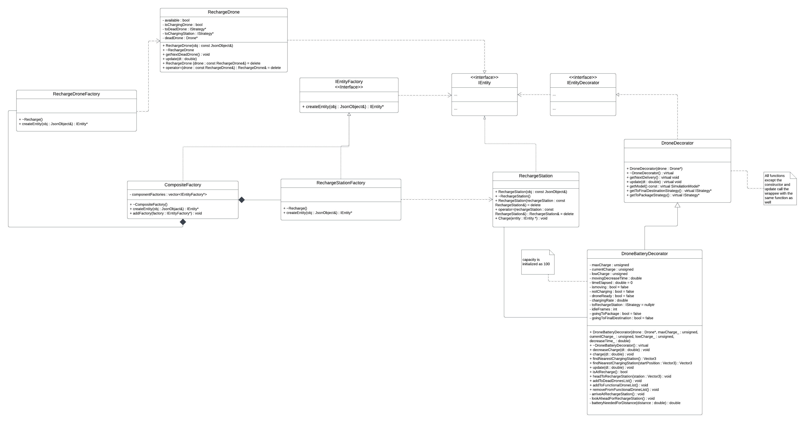
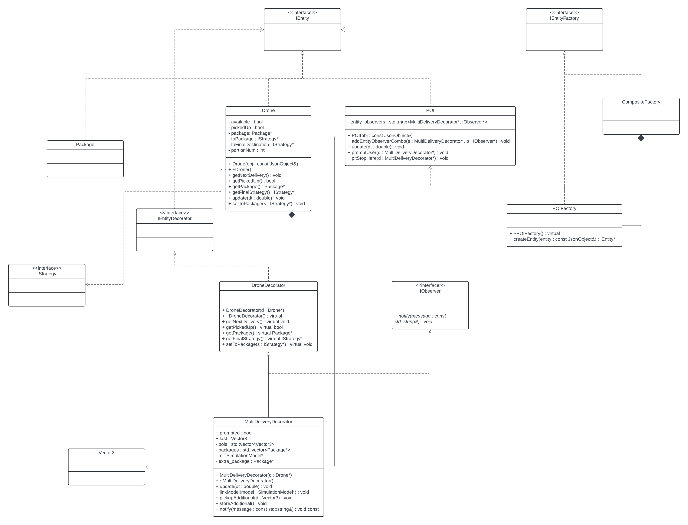

# CSCI 3081W Final Project

## Write up

### Deployment Guide

We recommend using `docker compse` to deploy.

```bash
git clone https://github.com/HongzhengL/drone-simulation.git
cd drone-simulation
docker compose up -d
```

By default, the service runs on port 40081. To specify a different port,
set the `PORT` environment variable before running the `docker compose`
command:

```bash
PORT=<CUSTOM_PORT> docker compose up -d
```

### Team number, member names, and x500s.

- Team-010-38
  - Alex Nagel, nagel213 (Extension 1)
  - Hongzheng Li, li003458 (Extension 1)
  - Samuel Breider, breid052 (Extension 6)
  - Daniel Wang, wan01271 (Extension 6)

### Project description

This project simulates a drone package delivery system with a couple real-world actors near the University of Minnesota Twin Cities campus and
implements several design patterns to uphold SOLID principles and develop new extensions to the existing delivery system. The main entities of concern
are helicopters, humans, packages, drones, and robots. The two new extensions developed include the implementation of battery packs
and recharge stations for drones, and the implementation of a way for drones to pick up and drop off additional packages along the way to the delivery location.

### How to build and run the project

For building from source code, please go to the root directory of the project and run the following commands:

```bash
make -j

make run # default port is 8081

# or use the following command to specify the port
./build/bin/transit_service <port to run> web/dist
```

For running the simulation using the Docker image, pull the project from Docker Hub first:

```bash
docker pull hongzhengli/final_project:latest
```

Then, run the following command to start the simulation,
replacing `<port to run>` with the port you want to run the simulation on:

```bash
docker run --rm -it -p <port to run>:8081 hongzhengli/final_project
```

To access the simulation after building and running it from the source code or Docker, go to http://localhost:8081 in your web browser.
If you specify a different port, or are using Docker, replace `8081` with the port you specified.

### What does the simulation do?

The simulation models a drone delivery system at the UMN Twin Cities campus that include some real-world entities.
The entities in the simulation have their own behavior and sometimes interact with other entities.
Helicopters fly in straight lines in random directions, humans run to random destinations, packages lay idle until picked up or
dropped off by a drone, drones pick up and drop off packages, and stationary robots receive dropped off packages.

Users will be able to select any of the available entities to view and follow, control the simulation's speed,
show all drone delivery routes, schedule trips for drone deliveries, add humans to the simulation, add drones to the simulation, and stop the simulation.
When scheduling trips for drone deliveries, the user will have the option of picking the pickup and dropoff points, naming the delivery, and also
choosing which pathing strategy (based on search algorithms) the drone uses to get from the package pickup point to the robot dropoff point.

The entities also have different behaviors implemented by various design patterns.
While the helicopter is flying, the simulation notifies the user of when the helicopter flies each mile.
When the human runs near Keller Hall, the simulation notifies the user.
When the drone completes a delivery, it will celebrate depending on the search algorithm it used.
When a package is created in the simulation, it will have a random color.

### Extension 1: Battery Packs

- **What does it do?**

  We added a battery to the drones in the simulation. The battery has a certain capacity and is drained as the drone operates.

  We also added recharge stations to the simulation. When a drone's battery is low, it will fly to the nearest recharge station to recharge.

  When the drone starts a delivery, it checks if the drone has enough charge to finish that delivery with some extra in order to get to a recharge station afterwards. If there is not enough charge, the drone will go to a recharge station first.

  In case the drone's battery is completely drained, we added a recharge drone that will fly to the drone and recharge it.

  We also added a feature that the once the drone arrives at a recharge station, there is a 10% chance that it will be malfunctioned for 10 seconds. During this time, the drone will not be able to recharge at the station.

- **Why is it significantly interesting?**

  In the real world, drones have limited battery capacity and need to be recharged.
  And there could be scenarios where the recharge station is malfunctioned and the drone does not have enough battery to complete the delivery, and the recharge drone offers a solution to this problem.
  This feature adds realism to the simulation.

- **How does it add to existing work?**

  We added a battery to the drones and recharge stations to the simulation. We also added a recharge drone to recharge the drones when the battery is completely drained.

  To connect the drones with the recharge stations and recharge drones, we used vectors to store the recharge stations and recharge drones in the simulation to be retrieved by the drones.

- **Which design patterns did you choose to use in your implementation, and why?**

  We used the **decorator pattern** to add the battery to the drones. This allows us to add the battery to the drones without changing too much on the existing code.

  We also used the **factory pattern** to create the recharge stations and recharge drones. This allows us to create the recharge stations and recharge drones without hard-coding the types into the code, promoting flexibility and scalability.

- **Instructions to use this new feature.**

  The feature is automatically enabled when the simulation is run. When the drone does not have enough battery for next pickup and delivery, it will fly to the nearest recharge station to recharge. When the drone is completely drained, the recharge drone will fly to the drone and recharge it.

### Extension 6: Double Delivery

- **What does it do?**

  We added Points of Interest (POIs) to the simulation so that if a drone is nearby a POI, the user has the option (given by a pop-up) to pick up an additional package
  at the POI and drop it off along with the original package at the original destination. If the user decides not to pick up an additional package, the drone
  will continue to the original destination with its original package.

  These POIs are represented by red balloons floating above hard-coded locations in the simulation. The locations that were hard-coded include the Gopher Pro Shop,
  the Gopher Bookstore, Subway, Raising Canes, and the Pioneer Dining Hall.

- **Why is it significantly interesting?**

  In the real world, deliveries can require multiple intermediate stopping points to pick up all the necessary items for the delivery. For example,
  if a customer ordered a pizza from Domino's but also ordered a taco from Taco Bell, the delivery driver would have to stop by both Domino's and Taco Bell
  to deliver the order completely. In this way, the simulation adds an extra consideration that is widely relevant in real life.

- **How does it add to existing work?**

  In order to create the POI entities effectively, we integrated it with the composite factory that the simulation had. To model the double delivery behavior,
  we implemented new functions into the Drone and Package classes and also defined new vectors for holding POI and package information in a decorator to the Drone
  class.

- **Which design patterns did you choose to use in your implementation, and why?**

  We used the **decorator pattern** to include the added functionality of double deliveries for drones. This allows us to add this extra behavior and possible
  other similar behaviors to the drone without changing too much of the drone's base code.

  We also used the **observer pattern** to help drones subscribe to POIs in the simulation. This allows the drone to be aware of when it passes a POI on its scheduled route,
  which allows the drone to either pick up or ignore the additional package at the POI.

  We also used the **factory pattern** to create the POIs. This allows us to create the POIs without hard-coding the types into the code, promoting flexibility and scalability.

- **Instructions to use this new feature.**

  When a delivery with the drone is scheduled, if the drone passes close enough to a POI while flying on its route to the destination, a pop-up will appear on the screen, asking
  the user if they want to add an additional package to the delivery. If the user chooses yes, the drone will beeline straight to the additional package, pick it up, and continue using the old pathing strategy to route to the original destination, where it will drop both packages off. If the user chooses no, the drone will continue on the original route to the destination with no additional package.

### Sprint retrospective

In our project, we had strengths in communication, time-management, and adaptability within the team. We communicated well as the project neared the deadline, we had good time-management to complete most of the implementation of the code within the first two weeks, and adapted quite well to any bugs or problems encountered as we integrated both extensions into the simulation. Overall, we could improve in early communication and planning for future projects. Though we had pretty strong communication near the middle/end, we could have communicated earlier to have a better time integrating both extensions together. We also did not make much use of Jira for planning; we communicated with Discord, which was good enough for our goals. However, planning might’ve gone smoother if we used Jira.

---

## Docker link

[Docker Image](https://hub.docker.com/repository/docker/hongzhengli/final_project/general)

---

## Video presentation link

[Video Presentation](https://youtu.be/a7HkonZaUc8)

[Presentation Slides](./pdf/CSCI_3081W_Final_Project.pdf)

---

## UML

### Battery Packs UML



### Double Delivery UML


